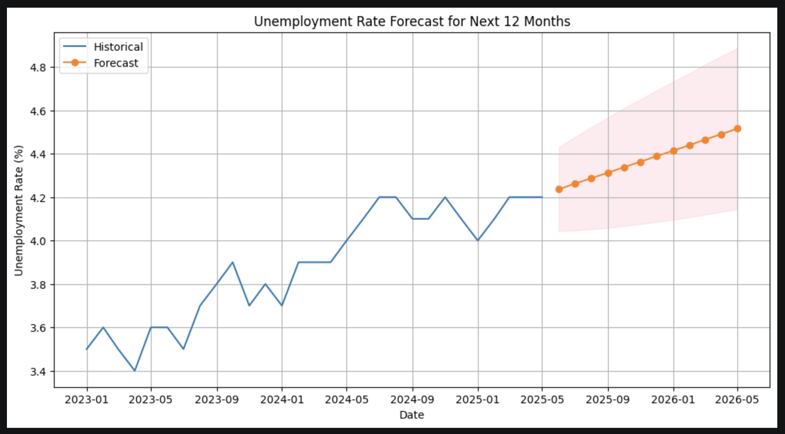
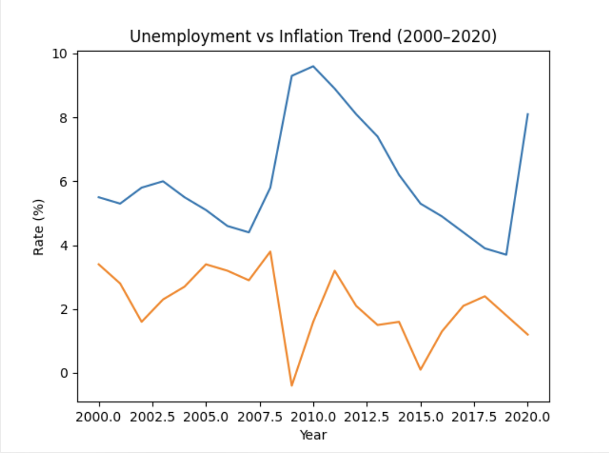

# Economic Crisis Analysis (2008)
##  Economic Crisis Analysis & Forecasting

---

##  Business Problem  
Financial institutions and policymakers need early indicators of economic instability to make informed decisions. However, identifying patterns in macroeconomic data is complex due to multiple influencing variables and long-term trends.

---

##  Objective  
To analyze long-term macroeconomic data and build forecasting models that identify patterns, trends, and potential indicators of economic crises.

---

##  Dataset  
- Macroeconomic data (20+ years)  
- Sources:
  - FRED (Federal Reserve Economic Data)  
  - BLS (Bureau of Labor Statistics)  
- Indicators:
  - GDP  
  - Unemployment Rate  
  - Inflation  
  - Interest Rates  

---

##  Tools & Technologies  
- Python (Pandas, NumPy, Statsmodels)  
- Matplotlib / Seaborn  
- API Integration (FRED, BLS)  

---

##  Project Workflow  
1. Data Collection via APIs  
2. Data Cleaning & Preprocessing  
3. Exploratory Data Analysis (EDA)  
4. Time Series Modeling (ARIMA)  
5. Trend & Pattern Analysis  
6. Visualization & Insights  

---

##  Approach  
- Collected macroeconomic indicators using APIs  
- Cleaned and structured long-term time series data  
- Performed exploratory data analysis to identify trends and relationships  
- Built ARIMA models for forecasting economic indicators  
- Analyzed relationships between variables to detect crisis signals  

---

##  Key Results  
- Identified patterns in unemployment, inflation, and GDP during economic downturns  
- Detected correlations between macroeconomic indicators  
- Generated forecasts for key economic variables  
- Highlighted potential early warning signals of economic instability  
 
---

##  Business Impact  
- Supports economic trend analysis and forecasting  
- Helps identify potential crisis indicators early  
- Enables data-driven financial and policy decisions  
- Improves understanding of macroeconomic relationships  

---

## 📊 Visualizations  

The chart below shows the trend and forecast of unemployment rate over time, highlighting patterns relevant to economic conditions:

The charts below illustrate trends in unemployment rate and its relationship with inflation over time, highlighting patterns relevant to economic conditions:

---

##  How to Run  

1. Clone the repository  
2. Install dependencies

 pip install -r requirements.txt
 
3. Run notebooks in order:
- data_collection.ipynb  
- data_cleaning.ipynb  
- analysis.ipynb   

