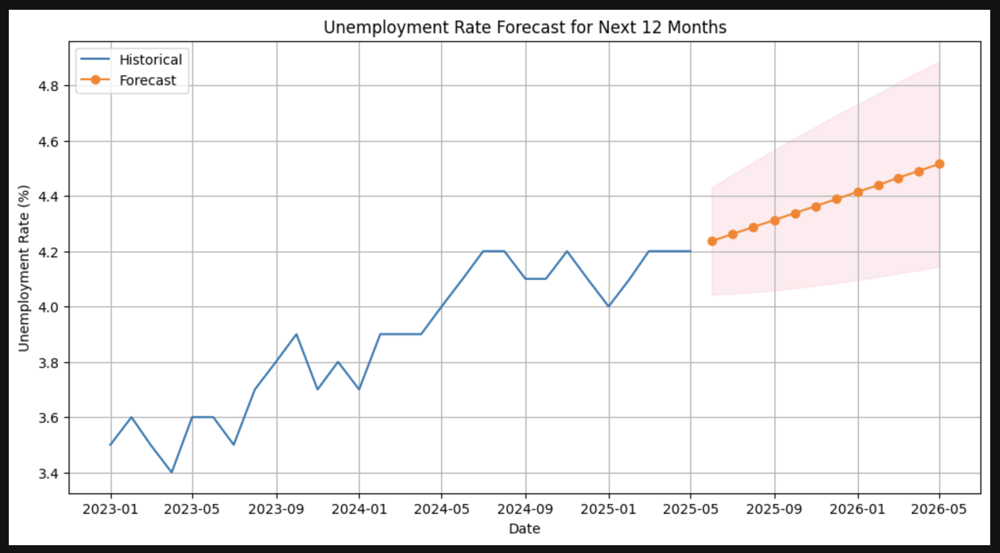
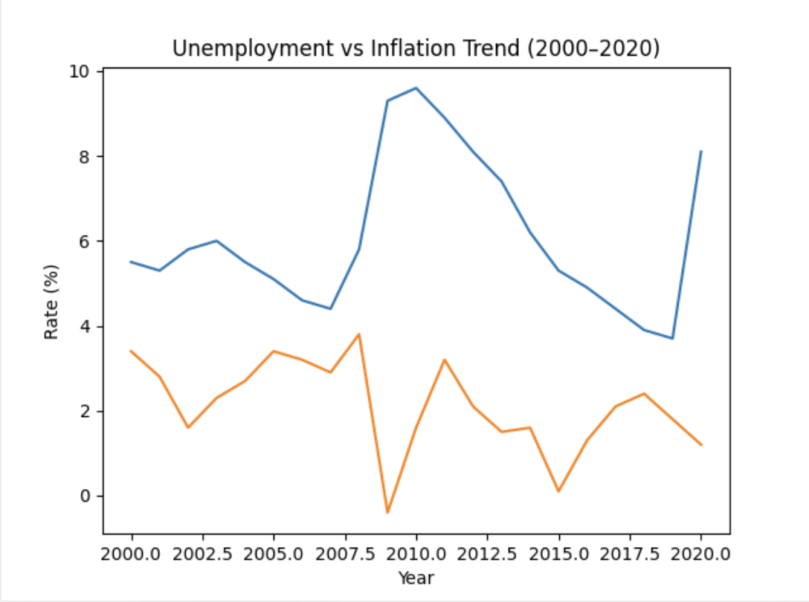

# US Unemployment and GDP Analysis

A Python portfolio project exploring US unemployment, GDP and time-series forecasting using public economic data.

The project covers data retrieval, preparation, visualization and an illustrative ARIMA forecast. Forecast accuracy has not yet been evaluated on held-out data.

[View Main Notebook](economic_crisis_analysis.ipynb) · [Unemployment Data](bls_unemployment.csv) · [GDP Data](GDP.csv)

## Project Objective

Explore unemployment trends, generate a twelve-month unemployment forecast and examine the relationship between unemployment and GDP in the available data.

## Tools Used

| Tool | Purpose |
|---|---|
| Python | Analysis workflow |
| Requests | Retrieve data from the BLS API |
| Pandas and NumPy | Data preparation and numerical analysis |
| Matplotlib and Seaborn | Charts and exploratory visualization |
| pmdarima | Automatic ARIMA model selection |
| Statsmodels | Time-series decomposition |
| Jupyter Notebook | Code, outputs and documentation |

## Data Sources and Coverage

### US Unemployment

The notebook requests the seasonally adjusted US unemployment-rate series `LNS14000000` from the Bureau of Labor Statistics API.

- Requested period: **2010–2024**
- Local snapshot: `bls_unemployment.csv`
- Actual returned coverage must be checked after retrieving the data.

### GDP

The repository includes `GDP.csv`. The notebook uses its `observation_date` and `GDP` columns.

Earlier project documentation identifies FRED as the source. The exact series metadata, units and export date still need to be confirmed against the original download.

### Crisis-Comparison Coverage

The unemployment API request begins in 2010 and therefore does not cover the 2008 financial crisis.

A supported comparison between 2008 and COVID-19 requires an extended dataset and explicit comparison analysis.

## Analysis Workflow

1. Retrieve unemployment observations from the BLS API.
2. Convert dates and numeric values into analysis-ready formats.
3. Inspect missing values and summary statistics.
4. Visualize unemployment trends and distributions.
5. Fit a non-seasonal ARIMA model using `auto_arima`.
6. Generate a twelve-month forecast with model-based uncertainty intervals.
7. Explore time-series decomposition using a twelve-month period.
8. Load the local GDP and unemployment datasets.
9. Merge observations by date and explore their relationship through correlations and charts.

## Selected Visualizations

These images are saved project outputs. Their labels and coverage should be checked against the underlying data when interpreting them.





## Interpretation

The analysis demonstrates how economic data can be collected, prepared and explored in Python.

The ARIMA forecast illustrates a forecasting workflow. Its predictive accuracy has not been established through chronological backtesting or comparison with a baseline.

GDP–unemployment correlations are descriptive. They do not establish causation or demonstrate that the project can predict economic crises.

## How to Run

### 1. Clone the Repository

```bash
git clone https://github.com/Balbir89/economic-crisis-analysis.git
cd economic-crisis-analysis
```

### 2. Install Dependencies

```bash
python -m pip install -r requirements.txt
python -m pip install requests pmdarima jupyter
```

The second command installs additional packages used by the workflow that are not included in the current requirements file.

### 3. Check the Data Files

Keep these files in the repository root:

- `GDP.csv`
- `bls_unemployment.csv`

Run the notebook with the repository root as its working directory so relative file paths resolve correctly.

### 4. Open the Notebook

```bash
jupyter notebook economic_crisis_analysis.ipynb
```

### 5. Provide Your BLS API Key

The corrected notebook reads the `BLS_API_KEY` environment variable. If it is not set, the notebook asks you to enter your key through a hidden input prompt:

```python
import os
from getpass import getpass

api_key = os.environ.get("BLS_API_KEY")

if not api_key:
    api_key = getpass("Enter your BLS API key: ")
```

Run this cell and enter your own BLS API key when prompted.

Keep `"BLS_API_KEY"` unchanged: it is the environment-variable name, not a placeholder for your actual key.

The BLS request uses the variable as follows:

```python
"registrationkey": api_key
```

Do not paste your actual key into the README or save it in notebook code. Replace any previously exposed key before using it.

### 6. Address the Remaining Execution Issues

Before running all cells:

- Move the first scatter-plot cell that uses `merged_df` below the cell that creates `merged_df`.
- Check the BLS response for errors and confirm the returned date range.
- Confirm that the local CSV columns match those referenced by the notebook.
- Review how monthly unemployment and quarterly GDP observations are aligned before interpreting their relationship.

The API-key edit has passed a Python syntax check. A clean top-to-bottom execution of the full notebook has not yet been verified.

## Repository Contents

| File | Description |
|---|---|
| `economic_crisis_analysis.ipynb` | Main exploratory analysis notebook |
| `analysis.ipynb` | Overlapping version of the analysis |
| `data_cleaning.ipynb` | Notebook containing no implemented code cells in the reviewed version |
| `GDP.csv` | Local GDP dataset |
| `bls_unemployment.csv` | Local unemployment dataset |
| `chart1.png` | Saved analysis chart |
| `chart2.png` | Saved analysis chart |
| `Crisis_Comparison_Charts.jpg` | Additional saved visualization |
| `requirements.txt` | Base Python dependencies |
| `README.md` | Project documentation |

## Limitations

- **Forecast evaluation:** No chronological holdout evaluation or baseline comparison is implemented.
- **Uncertainty intervals:** Model-generated intervals do not establish forecast accuracy.
- **Frequency alignment:** The current merge uses exact dates. Monthly unemployment and quarterly GDP require an explicit alignment method.
- **Correlation interpretation:** Trends and the use of GDP levels can affect the interpretation of correlations.
- **Seasonality:** Decomposition of a seasonally adjusted unemployment series does not establish meaningful underlying seasonality.
- **Historical revisions:** Revised economic data may differ from the information available at an earlier forecasting date.
- **Crisis coverage:** The unemployment request does not include 2008.
- **Reproducibility:** Execution order, API error handling and dependency versions need further work.

## Skills Demonstrated

- API-based economic data retrieval
- Data cleaning and date handling
- Exploratory data analysis
- Time-series visualization
- ARIMA model fitting and forecast generation
- Correlation analysis
- Documentation of analytical limitations

## Planned Improvements

- Consolidate the overlapping notebooks.
- Correct cell execution order and verify a complete run.
- Apply secure credential handling across all notebooks.
- Improve API-response validation and error handling.
- Document source series, units, download dates and actual coverage.
- Align monthly and quarterly data explicitly.
- Add chronological backtesting and a simple forecast baseline.
- Report forecast-error metrics on held-out observations.
- Extend historical coverage before comparing the 2008 and COVID-19 crises.
- Record tested dependency versions.

## Author

**Balbir Singh**  
M.Sc. Finance & Investment

- [LinkedIn](https://www.linkedin.com/in/balbir-finance-investment-berlin/)
- [GitHub](https://github.com/Balbir89)
- [Email](mailto:balbirbhatia.20@gmail.com)
